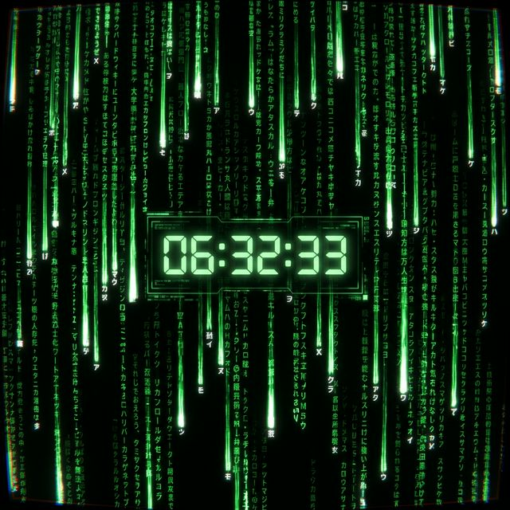

<div align="center">

# 🟢 Advanced Matrix Wallpaper

### *A cinematic, feature-rich Matrix rain wallpaper for [Lively Wallpaper](https://www.rocksdanister.com/lively/)*



[](LICENSE)


</div>

---

## ✨ Overview

**Advanced Matrix** is a fully interactive, cinematic desktop wallpaper built with vanilla HTML5 Canvas and JavaScript for use with [Lively Wallpaper](https://www.rocksdanister.com/lively/). Inspired by the iconic digital rain from *The Matrix* film trilogy, this project takes the concept far beyond a simple screen saver — packing in real-time audio reactivity, mouse interaction, depth layers, and extraordinary visual effects all controlled from Lively's built-in property panel.

> **"Wake up, Joseph... The Matrix has you..."**

---

## 🚀 Features

### 🎨 Visual
| Feature | Description |
|---|---|
| **Customizable Color** | Full color picker for the matrix rain characters |
| **Rainbow Mode** | Smooth chromatic cycling through the full color spectrum with adjustable speed |
| **Background Types** | Choose between Solid Black, a static image overlay, or the exclusive **Matrix Vision** mode |
| **Matrix Vision™** | Your image is rendered *through* the rain itself — each character's brightness is driven by the pixel luminance of your photo. Like seeing the world in code |

### ⚙️ Content
| Feature | Description |
|---|---|
| **3 Character Sets** | Custom text, Binary (0/1), or authentic Japanese Katakana characters |
| **Custom Characters** | Define any text string as your own character pool |
| **Cyberpunk Clock** | A large, glowing digital clock centered on the screen in Matrix style |

### 🔬 Advanced Effects
| Feature | Description |
|---|---|
| **3D Parallax Depth** | Rain falls in three depth layers — close drops fall fast, far drops fall slow — creating a true sense of 3D space |
| **Interactive Mouse** | Characters dodge the mouse cursor and glow brightly under it |
| **Audio Reactive** | Rain speed and brightness pulse in real-time to music/system audio |
| **Gravity Reversal Bass** | On heavy bass drops, gravity reverses — the rain shoots upward before falling back down |

### 🎬 Cinematic / Hacker
| Feature | Description |
|---|---|
| **"Wake Up" Intro** | On every launch, a typewriter-style message plays: *"Wake up, Joseph... The Matrix has you..."* before the rain begins |
| **Retro CRT Overlay** | Authentic CRT TV scanlines and chromatic aberration (RGB fringing) over the entire screen |
| **Random Glitch Effect** | Periodic CSS glitch animations that distort the screen like a corrupted signal |

---

## 📦 Installation

### Requirements
- **Windows 10 / 11**
- **[Lively Wallpaper](https://www.rocksdanister.com/lively/)** (free, open-source)

### Steps

1. **Download or clone** this repository:
   ```bash
   git clone https://github.com/rose1996iv/Advanced-Matrix.git
   ```

2. **Open Lively Wallpaper**

3. Click the **`+` (Add Wallpaper)** button

4. Choose **"Open from disk"** and navigate to the cloned folder

5. Select **`index.html`** — Lively will detect it as a Web Wallpaper

6. Click **Set as Wallpaper** 🎉

---

## 🛠️ Customization

All settings are available in the **Lively Wallpaper Customize Panel** (right-click the wallpaper → Customize):

```
── Visual Settings ──
  Matrix Color            → Color Picker
  Rainbow Mode            → Toggle
  Background Type         → Solid Black | Image | Matrix Vision™
  Background Image        → Select from /images/ folder
  Image Opacity (%)       → Slider (Normal mode only)

── Content Settings ──
  Character Set           → Custom | Binary | Japanese Kana
  Custom Characters       → Text Input
  Show Cyberpunk Clock    → Toggle

── Advanced Effects ──
  3D Parallax Depth       → Toggle
  Interactive Mouse       → Toggle
  Audio Reactive          → Toggle
  Gravity Reverse (Bass)  → Toggle

── Cinematic / Hacker ──
  "Wake Up" Intro         → Toggle
  Retro CRT Scanlines     → Toggle
  Random Screen Glitch    → Toggle
  Rain Speed Delay (ms)   → Slider (lower = faster)
```

### 🖼️ Adding Your Own Image for Matrix Vision

1. Place any `.png` or `.jpg` image into the `/images/` folder
2. In Lively Customize → **Background / Vision Image** → select your image
3. Set **Background Type** to `"Matrix Vision (Image via Rain)"`
4. Watch your photo emerge from the rain 🤯

---

## 🗂️ Project Structure

```
Advanced-Matrix/
├── index.html              # Main entry point
├── script.js               # All Matrix logic, effects, and Lively callbacks
├── style.css               # Styles, CRT overlay, Glitch keyframes
├── LivelyProperties.json   # Lively Wallpaper control panel definition
├── preview.png             # Preview screenshot
└── images/
    └── watermark.png       # Default background / Matrix Vision image
```

---

## 🧠 How Matrix Vision™ Works

Matrix Vision is a custom pixel-sampling technique:

1. The target image is drawn into a **hidden offscreen canvas**
2. Each frame, the `ImageData` pixel array is read
3. For every falling character, its screen position is sampled → a **luminance value** (0.0–1.0) is computed using the standard formula:  
   `L = 0.299R + 0.587G + 0.114B`
4. This luminance directly drives the **opacity/brightness** of that character
5. **Result:** Bright image regions → bright visible characters; dark regions → dim/invisible characters

The effect makes your image "emerge" through the rain — exactly as Neo perceives the Matrix.

---

## 🎵 Audio Reactivity

Lively Wallpaper exposes a `livelyAudioListener(audioArray)` callback that receives real-time system audio FFT data.

- **Normal audio** → slight brightness boost + speed increase  
- **Heavy bass peaks (> 85% amplitude)** → gravity flips: rain shoots upward  
- **Audio fades** → gravity returns downward

Enable/disable in the Customize panel under **"Audio Reactive"**.

---

## 📄 License

This project is licensed under the **MIT License** — free to use, modify, and distribute.

---

## 🙏 Credits

- **[Lively Wallpaper](https://github.com/rocksdanister/lively)** by [@rocksdanister](https://github.com/rocksdanister) — the open-source wallpaper engine that makes all of this possible.
- Inspired by the original Matrix digital rain concept from *The Matrix* (1999) by the Wachowskis.

---

<div align="center">

**Built with ❤️ and JavaScript**  
*"There is no spoon."*

</div>
